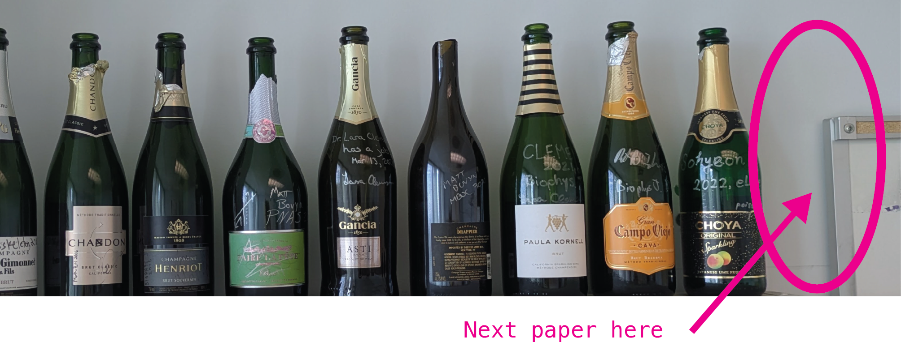

How I organize science projects in 2025
#######################################

*by Jun Allard*

... or, "How to be a Scientist in these easy steps!"

None of this is presprictive or optimized, here, although I do prescribe some things 
from my team, which are an intersecting set with things below.

Directory structure
------------------

For a new project, it immediately lives in six places::

    ReadCube/project_tag

    GoogleDrive/Notability/project_tag

    tex/project.tex -- internal notes
    tex/paper.tex -- will come later
    tex/figures/

    project_dir/plots
    project_dir/data
    project_dir/logs
    project_dir/presentations

    git/src
    git/notebooks 
    git/analyzers
    git/batch_scripts
    git/scratch

    GoogleDrive/project_tag/

The middle three (tex repo, project_dir where plots are stored, and code repo) are the big ones.
Only tex and git are version-controlled.
The others are backed up to the cloud, e.g., Allard Lab Google Drive.

Favorite software
---------------

Grasping and tracking the scientific problem:

* ReadCube (bibliography manager; Mendeley, Zotero?)
* Illustrator (Inkscape?)
* Notability
* Google Drive
* VSCode with Latex Workshop (huge filesize...)
* Overleaf
* GitKraken (git lens? gitUp?)

The computational approach:

* VSCode and Julia (VSCode and Matlab also has a plugin)
* iterm, zsh, OhMyZsh
* julialang
* Microsoft Excel
* SLURM, rsync, rclone

Scientific communication:

* Apple Keynote
* Latexit

Chronological timeline
--------------------

1. An idea, a dataset, a scientific question, a cool/fun puzzle and hypothesis
2. Coder at work! Part I: Before the first narrative
3. The first narrative
4. Coder at work! Part II: After the first narrative
5. Figures and captions
6. Big literature review
7. Forking latex repository
8. Results, Intro, Discussion, share with friends
9. Cover letter, referees, and submission
10. Revisions

... More accurately, it looks like this:

.. image:: figProjectTimeline.png
   :alt: Chronological timeline

An idea or cool hypothesis, literature
-----------------------------------

Very early, I create a place to put things (papers, code snippets, stray thoughts) and version-control these.
Streamline the process to store things. 
I never want to hesitate before *storing* something.

Make sketches in Notability or equivalent, and a pipeline to easily get these sketches into Illustrator and then the latex repo.
I find real creative thought happens through sketches.
As I like to say, "you are spending too much time plotting, not enough time sketching!"
(which is maybe related to the old addage about "forest for the trees").

Literature. Papers on the internet. 
Create a tag/Folder in ReadCube, and use the browser plugin to tag papers as I find them:

And then, get both citations and sketches into a tex repo!
My `prototype latex repo JunsLatexRepository <JunsLatexRepository>`_ with a fictitious project called JeanJacket.
One .tex for scratch notes, one for the eventual manuscript (which can wait).
My favorite ``.gitignore`` which I've accumulated over the years.
GitHub Actions in the ``.github`` directory will automatically compile the tex into pdf (so far, this is just a parlor trick, I've never found it useful).
Link to Overleaf if you have collaborators who like that (it's a button in Overleaf).

Coder at work! Part 1 and 2
--------------------------

There is a magic moment when you have the first draft of the 10-sentence narrative of the project. 
The reason "Coder at work!" splits into two parts is that the parts before and after the "magic moment" 
feel so different.
Sometimes the eventual final 10-sentence summary is known early, sometimes late.

Things that I've learned to do later than you might think
~~~~~~~~~~~~~~~~~~~~~~~~~~~~~~~~~~~~~~~~~~~~~~~~~~~~~~~~~~~~

In any project, there is *Question-space dimensionality expansion*. 
You don't know what parameter you are going to want to explore next. 
Until the first narrative (and even after it), open exploration is such a key part that I try hard to avoid the fallacy, "I will design the code to be flexible for any future question." 
I would always fail at trying to do code architecture in what IBM (I think?) called "waterfall" design.
Instead, I am constantly refactoring.
Therefore, before the "10-key-sentence moment", I am very forgiving of myself for bad overall code organization, subfolder organization, etc.
Instead, refactoring is a continuous process.
(Maybe this is what makes scientific computing most different than, e.g., app development?)
After the first narrative, I spend >20% of time and >50% of lines of code doing refactoring and code that organizes question-space dimensionality.

Things that I've learned to do *earlier* than you might think
~~~~~~~~~~~~~~~~~~~~~~~~~~~~~~~~~~~~~~~~~~~~~~~~~~~~~~~~~

Anything that allows me to easily create and store things:
``rsync``, ``ssh-keygen``, 
a script to organize run outputs, 
scripts that read in custom config files (one for a single local run, for a big hpc run, etc.)...

Code reproducibility: package management, virtual environments, avoiding "dependency hell": For Python and Julia, figure this out early! For Matlab, R, and some cases of C, this is less an issue. Remember that code reproducibility is not just about ensuring it works on a different machine in a different time, but also about ensuring it works for a different *person* (typically that there is tacit knowledge the first author forgot to write down).

Python::

    python3 -m venv venv
    source venv/bin/activate
    pip freeze > requirements.txt

Julia::

    ]
    activate .

For every run, it has both a 6-digit date and a ``run_name``. 
For run names, I use `foods in alphabetical order <https://chatgpt.com/share/67a96f7d-bf6c-8011-9170-5f729d700599>`_.
My students make fun of this, but it is for 2 reasons. 
First has to do with the unknown "question-space dimensionality". I don't always know what parameter I'm going to vary for the following run, so naming something ``different_param_B`` is impossible until I know it was going to be ``param B`` that I would want to vary.
Second, it reduces my emotional attachment to any given run.
I accept that it's all going to be redone! As the saying goes, treat your runs as **cattle, not pets**!

Consistent with the policy of making it easy to create and store things, I have `script that automatically create folders with the date, and define the project directory <JunTools.jl>`_ in a Julia package called ``JunTools.jl`` so that I can do things like::

    run_name = "bubblegum"

    base_path = JunTools.get_base_path("TCRPulsing")
    data_path = JunTools.get_data_path("TCRPulsing")

    this_run_description = my_config["run_name"] * "_" * join(my_config["these_on_time_indexes"], "_")   

    # ... rest of code ...

    @save joinpath(data_path, this_run_description * "_something.jdl2") results context_object

My "Coder at work!" flow
*************************

As I work, I usually have 3 VSCode windows open: the latex repo, the code repo, and the folder where the plots and logs live.
You can get them to all have a different specified color theme using ``code-workspace`` files.
A surprising amount of time is spent "tabbing" to the latex repo window, where I'm constantly taking notes, recording what model equations I'm currently using, etc.

How often should you ``git commit``? How to quickly write useful commit messages?
One trick that helped me think about this cleanly, and make much better commit messages, is a subfolder convention: git branch names can contain a slash, so you can give their names "folders".
What you are doing at any one moment fits into a half-dozen categories:
Debugging, adding a feature, producing results. 
So, my branch names are usually things like, ``debug/memory-leak``, ``feature/convex-optimizer``, etc.

Minimal working example in a ``README.md`` entitled ``Quickstart`` or similar. Usually, if another person can figure out how to get anything working end-to-end, they can begin to figure out the rest of your codebase.

How I organize code in subfolders:
``src`` versus ``notebooks``. 
I should never run something directly in ``src``, rather it should be run from a script in a notebook. 
One notebook should never call something from another notebook; anything reused should go in ``src``.

The magic 10-key-sentence moment
-----------------------------

There is a magic moment when you can describe the proposed work in 5-15 sentences.
With this little full-sentence blurb, someone can identify a gap in knowledge and an approach that addressed the gap.
Early on, before we have the result, we word it as Hypotheses, and later on, the grammer will change, and it will be a Conclusion. 
Reading the 10 sentences *standalone* should be enough to understand the gap being addressed or new thing being contributed and why it is valuable. To exaggerate slightly: Everything except for validity of results, which goes into the paper.
It's not quite an abstract, because it can be longer, have citations, etc., but it has the same approximately five-part structure:

1. Background and broad question
2. Specific question that we will deliver on
3. "Here we..."
4. Results, which are in the form of sentences, not plots
5. Implications

.. image:: https://preview.redd.it/it-is-possible-to-do-this-in-latex-v0-7fdnco9qa3ge1.png?auto=webp&s=46b3ea51c54f40c2a5ca7bc455d17119e459e224
   :alt: Nature Abstract guide
   :width: 400

I try to see the 10 sentences as early as I can. 
Don't be afraid to write the first one down, and change it later as results and project goals evolve. 
A reason for this is that so many small decisions depend on the 10-key-sentence. 
Poor decisions will come back and bite you, but until you have the 10-sentence narrative, dwelling on these decisions won't help, meaning good decisions will also come back and bite you!

A good 10-key-sentence summary implies a plan/wishlist for the **Figures and Captions**.

The Keynote poster and talk escape arrow
-------------------------------------

Think of all figures in Illustrator for the paper, and then make an edited version for Keynote (poster or talk).
I don't remake the axes or labels in Illustrator, rather I just go into Keynote, put a white rectangle (or whatever color background) and put the text in Keynote. Easier to edit.

From Figures and Captions to a draft manuscript!
--------------------------------------------

The "10-key-sentence" thing ended with having a wishlist for Figures and Captions. 
Once I have the first draft of these, then:

1. Find some role-model papers, just to get inspiration for how to arrange figures, expose statements, organize subsections. Ideally the role-model paper is from a similar journal to the one we are targeting.
2. Assemble figures, write captions. Nice meaty captions: A good paper can be followed by reading captions alone (without reading Main Text).
3. Write Results text, Methods/Model text, Supplement. A good paper can be followed by reading Results text alone (without looking at figs).
4. Big literature review, spend a few days, re-read ~15 papers, search for anything we missed.
5. Write Discussion text. Connect to the field. Rank order paragraphs from most important to least important. Be upfront, but not apologetic, about limitations of work.
6. Write Intro text. The main purpose of Intro is to describe the gap in knowledge. Writing such a short overview of the field requires you to have an opinion of the field -- mark of scientific maturity.
7. Assemble, polish. Clean up references. Give to lots of people for feedback. Get ideas for suggested referees.
8. Draft cover letter to the handling editor. Key questions to answer in a cover letter: (1) How will this work make others think differently and move the field forward? (2) How does our work relate to current literature? (3) Who is the most relevant audience for the work? (4) What has the work accomplished and what has it not achieved?

Git, GitHub, Latex in VSCode, Overleaf, and the transition to PI-as-decision-owner
-----------------------------------------------------------------------------

Writing with multiple authors in latex+git:

When writing in latex, put every sentence on its own line. 
This makes version control much better, and whitespace doesn't influence the compiled pdf.

How do I fork it? How do I link it to Overleaf?
Suppose one of us has made a change. How do I see the change? How do I get it into my repo?
Oh shit, I screwed up git! Don't worry, it happens all the time: https://ohshitgit.com/. 
LLMs like ChatGPT and Claude.ai are so-far amazing at helping with git issues.

Useful heuristics about git, neither of which are strictly true but useful as first approximations:

1. You need to be on a branch to edit that branch. All other branches are untouchable from your current branch.
2. Any action involving multiple users (pull request, merge), I do on the GitHub.com web interface

Transition to PI-as-decision-owner.
No matter how big the team is, at some point, near peer-review manuscript submission, one person (the PI/Corresponding) takes role as final decision-owner.
..
   Towards the end, we strive for a *culture* of concensus and discussion, but a *policy* of clear decision-ownership, so we don't get stuck in never-ending decision making, so things can actually get done. 
My sacred principle, in order to be honest to my job of contributing new knowledge into the scientific world, is this: Whenever I think, "wouldn't it be nice to do more of *x* before submitting?", I always remind myself, the world doesn't benefit from something you didn't share!

Revisions!
---------

Triple document structure for Revisions.
My workflow for resubmissions is as follows. It's kind of cumbersome but I find it works.
First, I read everything through and the **wait for a full 24 hours, to let my own emotions cool**. 
Then, I go through the comments and give every Reviewer comment a code, like ``Rev1Minor3``.
Note this is an opinionated, careful, thought-provoking process in itself. Then, I create three google docs:

* A Big Notes doc with the Reviewer comments, todo lists / Action Items, paragraph drafts for the response letter, paragraph drafts for the new manuscript, and other notes.

* A "Dashboard" doc with very short summary of each comment, so we can check them off as we go -- like a progress dashboard.

* Another doc for the actual careful response letter. This is mostly blank for now, but then can be made quickly following cut-and-paste from Big Notes, and then edited carefully, especially for tone, which is easy to get wrong.

It feels amazing to check off something in the dashboard.

.. image:: figDashboard.png
   :alt: Revision dashboard

Bubbly bottle signing event
-------------------------

When it gets accepted, the first author signs a bottle of bubbly:

Closing thoughts
--------------

* How do we deal with proprietary/free/open-source/pay software? Should I switch to Inkspace?

* I use MacOS and Linux. How are things in Microsoft Windows?

* What are your tricks and tips?
